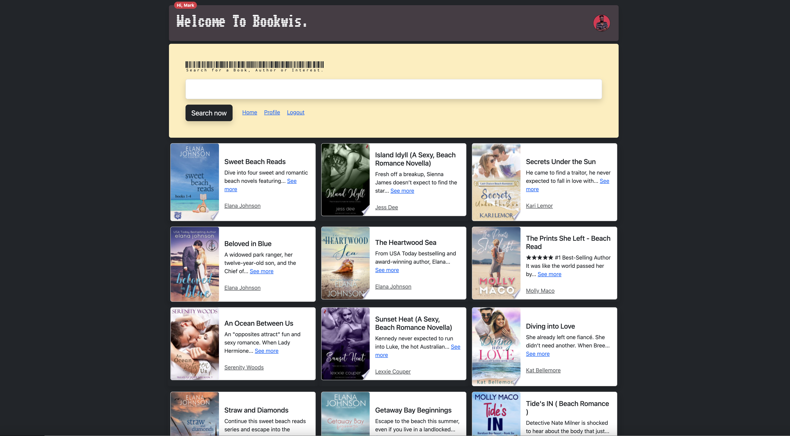
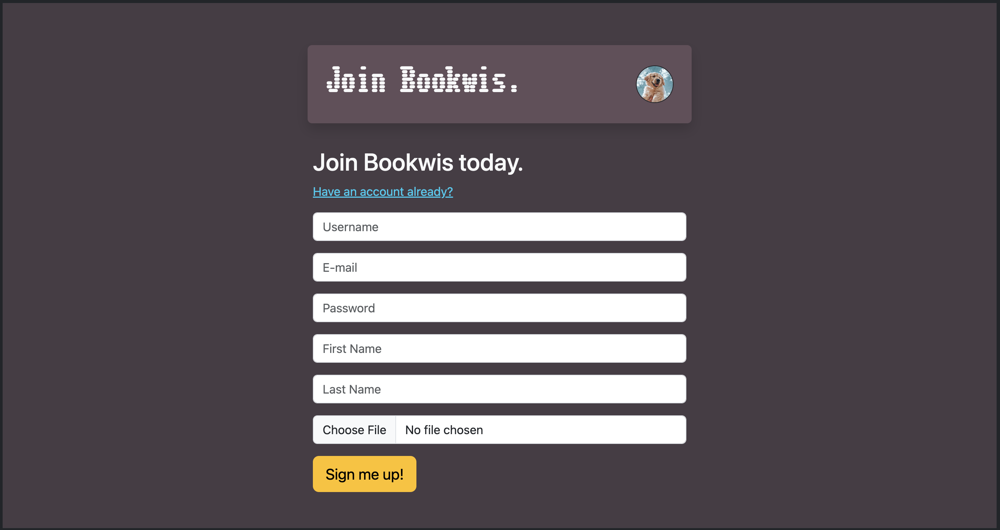
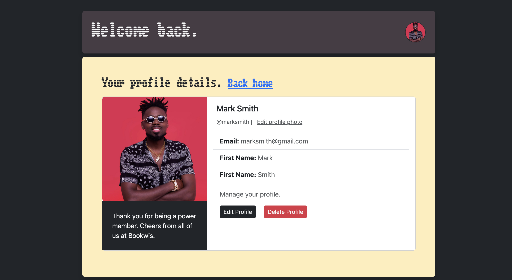

# Welcome To Bookwis



# BookWis App

BookWis is a web application that allows users to search and explore books using the Google Books API. Users can sign up, log in, and perform searches for books based on their interests. The application provides a user-friendly interface to view search results, explore book details, and manage user profiles.

## Table of Contents

- [Features](#features)
- [Getting Started](#getting-started)
- [Dependencies](#dependencies)
- [Installation](#installation)
- [Configuration](#configuration)
- [Usage](#usage)
- [Routes](#routes)
- [Contributing](#contributing)
- [License](#license)

## Features

- **User Authentication**: Users can sign up, log in, and log out to manage their search history and preferences.
- **Search Books**: Users can search for books based on different criteria using the Google Books API.
- **User Profile**: Each user has a profile page displaying their search history.
- **Profile Editing**: Users can edit their profiles, including updating their usernames, emails, and passwords.
- **Profile Picture**: Users can upload and update their profile pictures.
- **Delete Account**: Users have the option to delete their accounts.

## Sign-Up



## Login


## Profile



## Getting Started

These instructions will help you set up the BookWis app on your local machine.

### Dependencies

Before running the application, make sure you have the following dependencies installed:

- [Python](https://www.python.org/)
- [PostgreSQL](https://www.postgresql.org/)
- [pip](https://pip.pypa.io/en/stable/)

### Installation

1. Clone the repository:

   ```bash
   git clone
   ```

2. Navigate to the project directory:

   ```bash
   cd bookwis-app
   ```

3. Create and activate a virtual environment:

   ```bash
   python -m venv venv
   source venv/bin/activate   # On Windows, use `venv\Scripts\activate`
   ```

4. Install the required packages:

   ```bash
   pip install -r requirements.txt
   ```

### Configuration

1. Create a PostgreSQL database:

   ```bash
   createdb bookwis
   ```

2. Set environment variables:

   ```bash
   export DATABASE_URL="postgresql:///bookwis"
   export SECRET_KEY="your-secret-key"
   export GOOGLE_BOOKS_API_KEY="your-google-books-api-key"
   ```

   Replace `your-secret-key` and `your-google-books-api-key` with your preferred secret key and a valid Google Books API key.

### Usage

Run the application:

```bash
python app.py
```

Visit [http://localhost:5000/](http://localhost:5000/) in your web browser to access the BookWis app.

## Routes

- **/signup**: User registration page.
- **/login**: User login page.
- **/logout**: Logout the current user.
- **/search**: Perform book searches.
- **/results**: Display search results.
- **/profile**: User profile page.
- **/profile/edit**: Edit user profile.
- **/profile/photo**: Update user profile picture.
- **/profile/delete**: Delete user account.
- **/author/<name>**: Display details of an author and their books.
- **/books/<volume_id>**: Display details of a specific book.

## Contributing

Contributions are welcome! Feel free to open issues or pull requests.

## License

This project is licensed under the MIT License - see the [LICENSE](LICENSE) file for details.

## Developer:

Samuel Abinsinguza

Bookwis - Explore, Connect, Read!
Bookwis - Your Next Book Adventure Starts Here!
Bookwis - Because every book has a story worth sharing!
